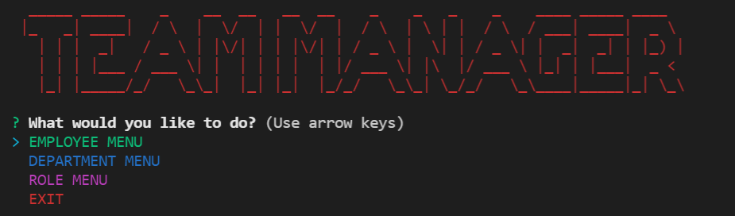

# Team Manager

## License

## Table of Contents

1. [Project Description](#project-description)
2. [Installation Instructions](#installation-instructions)
3. [Usage Information](#usage-information)
4. [Contributor Guidelines](#contributor-guidelines)
5. [Testing Instructions](#testing-instructions)
6. [License Info](#license-info)
7. [Questions](#questions)

## Visual Demonstration

[CLICK HERE FOR THE FULL DEMONSTRATION VIDEO!](./assets/snapshot.png)

## Project Description

* The team manager application allows you to create, read, update and delete employee data including: name, role, department, manager and salary.

## Installation Instructions

* Pull the Github repository to your local drive, open it in an IDE and enter "npm install" in the terminal to install the dependent modules from the package.json file in the root folder. Then enter NPM start in the terminal browse through the various menus to edit employee data.

## Usage Information

* You can try out the app locally in your terminal using the installation instructions above.

## Contributor Guidelines

* [Submit bugs and feature requests](https://github.com/joshsands/team-manager/issues).
* Review [source code changes](https://github.com/joshsands/team-manager/pulls).

## Test Instructions

* None

## License Info

Copyright 2021
The source code for the site is licensed under the MIT license and can be found at the link below:
[License Info Link](https://opensource.org/licenses/MIT)
      

## Questions?

* Find me on Github at [Joshsands](http://github.com/Joshsands).
* E-mail me at josh.sands@mail.com.